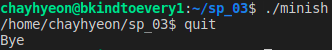

# System Programming report

| 20195155 | 임채현 | bkindtoevery1@gist.ac.kr |
| -------- | -------- | -------- 

### (a) How to compile and how to execute? LINUX, CYGWIN, or WSL?
I used Ubuntu 20.04, which can be dual-booted with windows 10. You can compile this for the following steps.

1. unzip the zip file
2. change the directory into the folder
3. type `make`

And then the executable file named `minish` would be made.
Finally, type `./minish` to execute.

### (b), \(c\) What functionality was implemented? How was it implemented? (explain briefly)
##### 1. Basic execution of commands.

`minish` can execute linux commands which are in the `/bin` folder.
It correctly executed because `execvp(location, args)` function is used.

`minish` can be terminated using `quit` command.
It is correct because if `strcmp(args[0], "quit") == 0`, then the program will `exit(0)`.

##### 2. Signals

`minish` doesn't affect by SIGINT(Ctrl+c), because `signal(SIGINT, sig_int)` function is used.

##### 3. Prompt

As you can see in the picture, the location of the file is printed in terminal. It is correct because `getcwd(pwd, 500)` is used.

### (d) Conclusion
I made the basic `minish` which satisfies the minimum spec(100pts), but didn't made the additional requirement.